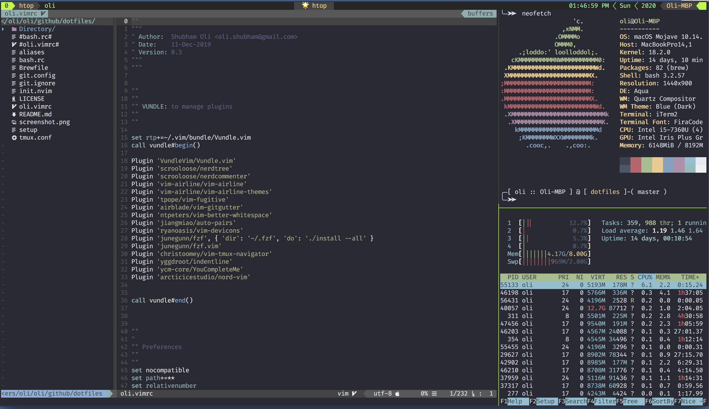

# .(dot)files

Author: Shubham Oli [oli.shubham@gmail.com]

------

## Installation

1. `git clone https://github.com/shubhamoli/dotfiles`
2. `cd dotfiles`
3. `/bin/sh setup`

## Config files

- `nvim/`
- `alacritty/`
- `.tmux.conf`
- `.bashrc`
- `.vimrc`
- `aliases`
- `.config`

## LICENSE
MIT
